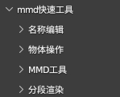
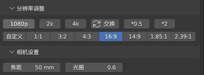

# mmd-Quick-tool 简介
这是一个使用blender制作mmd中简化操作，提升制作效率的工具，什么功能都可能会往里加~~

## 安装方式
1.在github右侧releases中下载最新版插件
2.打开blender首选项,右上角安装中选择插件压缩包,勾上即可

如果你安装了MMDtool插件,那么这个插件应该会在n面板的MMD栏下出现

## 使用说明

### 主界面  
  
### 1. 名称编辑
1. **材质到网格:** 将网格名称设置为材质名称  
2. **网格到材质:** 将材质名称设置为网格名称  
3. **贴图到材质:** 将材质名称设置为基础色贴图名称  
检测的接口: `["Color", "Base Color", "Diffuse Color", "Albedo", "Base Tex"] `

### 2.合并相同贴图的材质
如果连接到基础色上的贴图是一样的话,就将他们合并,主要用于合并mmdtool导入的重复的材质
### 3.替换mmd材质节点组
将mmdtool导入的材质中自带的节点组替换为原理化节点,方便自己调材质

### 3.为abc添加材质
点击后选择导出abc文件时产生的`alembic_file.mtl`文件,`alembic_file.mtl`文件需要和导出时的贴图在同一个文件夹  
这个按钮会为场景中导入的abc文件添加材质,仅支持为一个人物添加

### 分辨率界面

1. **快速切换分辨率比例:**点击选项快速切换分辨率,输出比例,交换x,y的分辨率,尺寸*2,/2  

### 灯光界面  
1. **随机灯光颜色:** 随机选中的灯光的颜色
2. **快速调整灯光角度:** 

## 其他
插件使用blender中的serpens3插件制作,如果有修改插件的需要,在blender安装serpens插件后下载并打开blender文件即可

