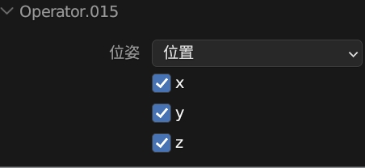
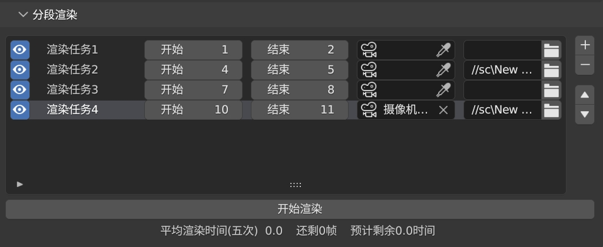

# mmd-Quick-tool 简介
这是一个为了在blender制作MMD或其他项目是提升效率的工具,主要为了解决平时遇到的繁琐操作解决痛点,功能是想到啥做啥~~

## 安装方式
1. **在github右侧releases中下载最新版插件**
2. **打开blender首选项,右上角安装中选择插件压缩包,勾上即可**
*如果你安装了MMDtool插件,那么这个插件应该会在n面板的MMD栏下出现*

## 使用说明

### 主面板
  
#### 名称编辑
1. **材质到网格:** 将网格名称设置为材质名称  
2. **网格到材质:** 将材质名称设置为网格名称  
3. **贴图到材质:** 将材质名称设置为基础色贴图名称  
检测的接口: `["Color", "Base Color", "Diffuse Color", "Albedo", "Base Tex"] `

#### 物体操作
1. **位姿归零:** 选中一个或多个物体,点击后可将位置归零,在弹出的菜单可以选择旋转,缩放(轴向缩放回到1),归零的轴向
 

#### MMD工具

1. **合并相同贴图的材质** 如果连接到基础色上的贴图是一样的话,就将他们合并,主要用于合并mmdtool导入的重复的材质

2. **替换mmd材质节点组** 将mmdtool导入的材质中自带的节点组替换为原理化节点,方便自己调材质

3. **为abc添加材质** 点击后选择导出abc文件时产生的`alembic_file.mtl`文件,`alembic_file.mtl`文件需要和导出时的贴图在同一个文件夹,这个按钮会为场景中导入的abc文件添加材质,仅支持为一个人物添加

#### 分段渲染(队列渲染)
*点击加号添加渲染队列*

1. **眼睛符号:** 关闭则跳过这一队列

2. **队列名称:** 渲染队列的名称,可以编辑

3. **开始帧:** 渲染的开始帧

4. **结束帧:** 渲染的结束帧

5. **摄像机:** 这一渲染队列使用的摄像机,如果为空则使用场景活动摄像机

6. **输出路径:** 这一渲染队列的输出路径,如果为空则使用默认输出路径

***开始渲染:*** 点击开始队列渲染

*按钮下方显示,当前正在渲染第几个队列的第几帧,前五帧的平均渲染时间,还剩几帧,预计还有多久渲染完成*

### 分辨率界面

1. **快速切换分辨率比例:** 点击选项快速切换分辨率,输出比例,交换x,y的分辨率,尺寸*2,/2  
2. **相机设置:** 同步修改相机的焦距和光圈

### 灯光界面  
1. **快速亮度调节:** 快速亮度调节
2. **随机灯光颜色:** 随机选中的灯光的颜色

### 其他
#### 3D视图顶部
1. **中英文切换:** 中英文切换
2. **清理数据:** 清理无用数据块

#### 时间线左边
1. **分,秒显示** 显示当前帧在第几分第几秒,小数点后表示秒,小数点前表示分,可双向调整

## 其他
插件使用blender中的serpens3插件制作,如果有修改插件的需要,在blender安装serpens插件后下载并打开blender文件即可

